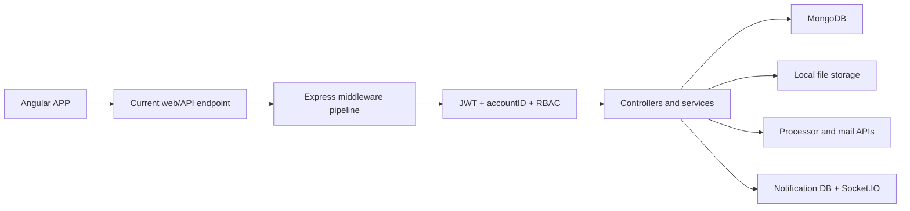
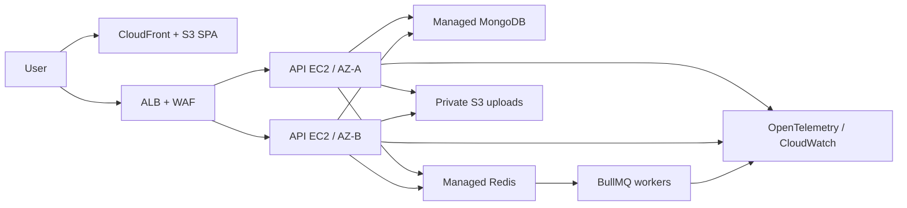

# Architecture

## Current request flow

Middleware order is security-significant: request context, CORS/Helmet, parsers,
payload response/request crypto, sanitization, activity logging, rate limiting,
compression, authentication, module routes, not-found handling, then errors.

## Target production topology

## Dependency rules

- Controllers translate HTTP input/output; they do not own persistence policy.
- Services own business rules and transaction boundaries.
- Repositories own tenant-scoped database access and projections.
- Models define persistence structure, indexes, and invariants.
- Workers call the same domain services as HTTP flows; they do not duplicate
  business rules.
- Cross-module side effects use versioned outbox events.
- Common infrastructure may depend on configuration; configuration must not
  import business modules.

## Scaling rules

- Socket.IO remains notification-only and uses the Redis adapter before a
  second API instance is enabled.
- ALB stickiness remains enabled while polling transport is supported.
- Cron ownership moves to durable queued schedules or a single elected worker.
- Local memory is never the source of truth for sessions, rate limits, jobs, or
  tenant data.
- Redis failure may degrade cache/performance, but must not corrupt MongoDB
  business data.

